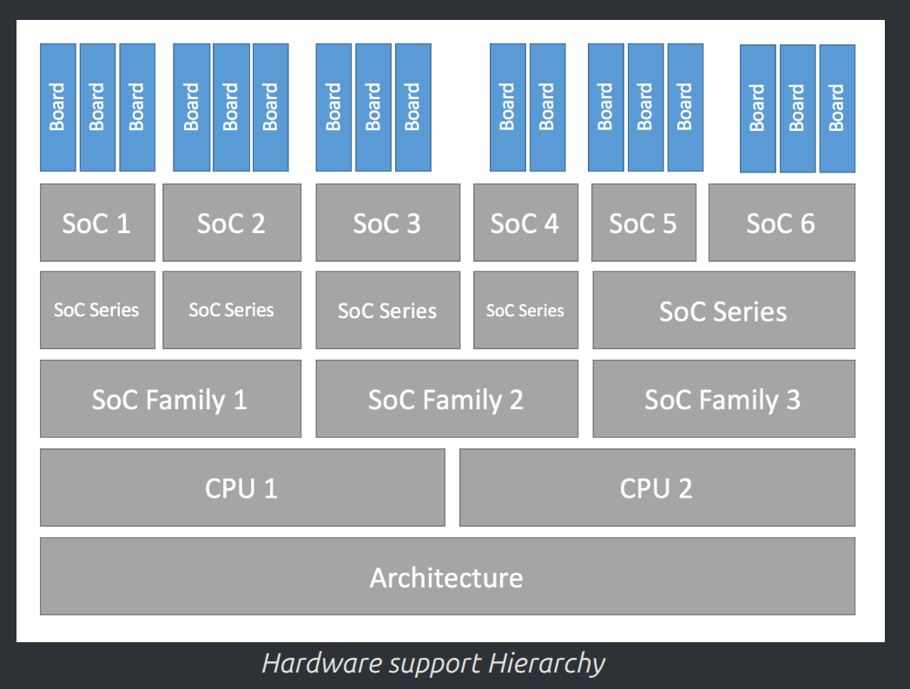
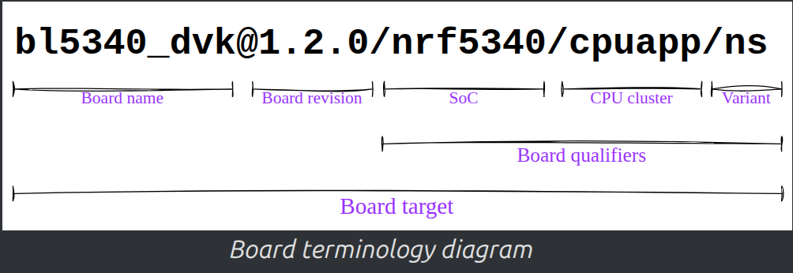
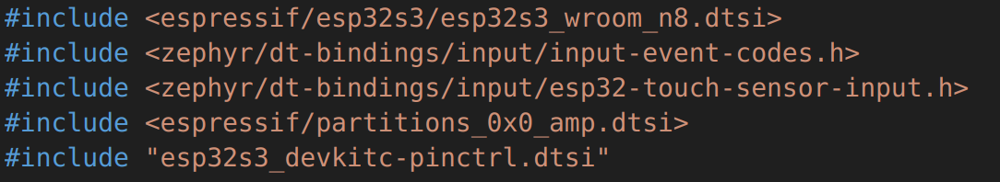
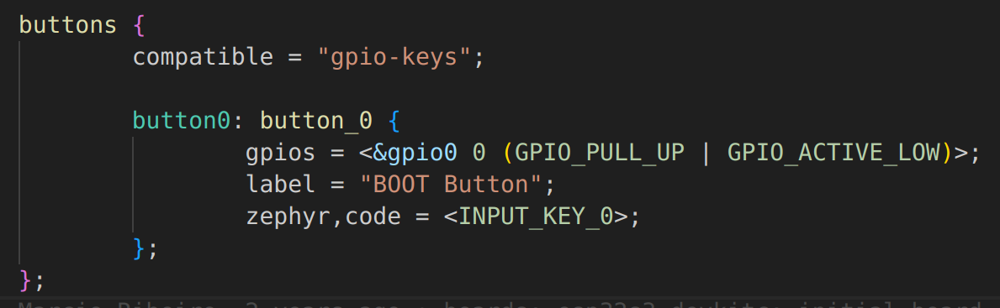

# Custom boards

<!-- TOC -->

- [Custom boards](#custom-boards)
  - [Hardware support hierarchy](#hardware-support-hierarchy)
    - [Reccomended folder structure](#reccomended-folder-structure)
  - [Setting up a custom board](#setting-up-a-custom-board)
    - [`boards/espressif/esp32s3_devkitc/board.cmake`](#boardsespressifesp32s3_devkitcboardcmake)
    - [esp32s3_devkitc_procpu_defconfig](#esp32s3_devkitc_procpu_defconfig)
    - [`esp32s3_devkitc_procpu.dts`](#esp32s3_devkitc_procpudts)
    - [Twister](#twister)
    - [esp32s3_devkitc-pinctrl.dtsi](#esp32s3_devkitc-pinctrldtsi)
    - [Kconfig](#kconfig)
    - [Kconfig.esp32s3_devkitc](#kconfigesp32s3_devkitc)
    - [kconfig.csis](#kconfigcsis)

<!-- /TOC -->

One of the frustrating things about Zephyr when I first started learning
it was the idea that all projects had to be built for a board. Zephyr
supports a number of official boards, but these are almost always vendor
or third-party produced dev kits. Most embedded developers usually want to ultimately move to a custom PCB for their end product or
project. Like most things in Zephyr, creating a custom board definition
requires you to understand K config and the devicetree.

[The Board Porting Guide](https://docs.zephyrproject.org/latest/hardware/porting/board_porting.html) in the Zephyr documentation is the best place to start when learning how to create a custom board. It walks you through the process, or at least the theoretical concepts.

## Hardware support hierarchy

One of the key things to understand is the **hardware support hierarchy** and the naming conventions used within Zephyr.



At the top level, you have the architecture. Within an architecture, there can be multiple CPUs—for example, in the Extensa architecture, you might have both the Pro CPU and the App CPU. Beneath that, you may encounter different families, though these are typically grouped within a single SoC (System on Chip).

In our case, the SoC is the ESP32S3, and we can define one or more boards that build upon this SoC layer. That’s why, when we build a Zephyr project, we specify the board first—such as esp32s3_devkitc—followed by the SoC (ESP32S3).

While you may sometimes need to explicitly specify the CPU (for example, the App CPU or the Pro CPU), you generally don’t need to specify the architecture during a build. The architecture layer provides the foundation, which is why you’ll often find CPU drivers and related code located within the extensa directory in the Zephyr source tree. Here's the terminology you’ll encounter:



- First, there’s the board name—for example, esp32s3_devkitc. You may also have a board revision, though in our case we don’t use one for this series.

- Next is the SoC, which for us is the ESP32S3. Then comes the CPU cluster—while Zephyr supports configurations with multiple CPUs, in our setup we only have a single CPU. We’ve been working with the Pro CPU rather than the App CPU.

- You might also encounter a variant, though it’s optional. Variants are typically used to distinguish between builds such as secure and non-secure versions on boards that support Trusted Firmware-M.

### Reccomended folder structure

This structure and the naming of its files is extremely important.

```ini
boards/<VENDOR>/plank
├── board.yml
├── board.cmake
├── CMakeLists.txt
├── doc
│   ├── plank.webp
│   └── index.rst
├── Kconfig.plank
├── Kconfig.defconfig
├── plank_<qualifiers>_defconfig
├── plank_<qualifiers>.dts
└── plank_<qualifiers>.yaml
```

In the example provided, the board name is plank. Pay close attention to where that name appears, both in the filenames and inside the files themselves. Zephyr relies on specific naming patterns to correctly recognize and process your board configuration.

For instance, you must include a file named Kconfig.board_name so Zephyr can properly identify and interpret the board definition. Behind the scenes, Zephyr automatically searches for these particular filenames within the board’s directory.

The documentation lists the mandatory files required for every board definition:

- board.yaml – defines metadata for the board.

- board_name.dts – the main Devicetree source file.

- Kconfig.board_name – the essential Kconfig file Zephyr uses for configuration.

These three files are required for a valid board definition.

For the ESP32S3, we also deal with qualifiers—for example, specifying which CPU we’re building for, such as the App CPU or Pro CPU. In our case, we use the SoC ESP32S3 and the Pro CPU, which together form the qualifier used in our build process.

By including these qualifiers in the file names, Zephyr knows exactly which files to reference when building for a specific board or CPU. It uses this naming convention to match and load the appropriate files from your board support package.

## Setting up a custom board

With that in mind, let’s define our own custom board, using the ESP32S3 DevKit C as our starting point.

When creating a custom board, it’s best to begin with the development kit you’ve already been using. This gives you a working foundation to build upon and helps ensure compatibility with existing configurations.

In Zephyr, navigate to the boards directory, then to the espressif folder, and open the esp32s3_devkitc board. You’ll see the same files referenced earlier in the documentation.

### `boards/espressif/esp32s3_devkitc/board.cmake`

```cmake
# SPDX-License-Identifier: Apache-2.0

if(NOT "${OPENOCD}" MATCHES "^${ESPRESSIF_TOOLCHAIN_PATH}/.*")
 set(OPENOCD OPENOCD-NOTFOUND)
endif()
find_program(OPENOCD openocd PATHS ${ESPRESSIF_TOOLCHAIN_PATH}/openocd-esp32/bin NO_DEFAULT_PATH)

include(${ZEPHYR_BASE}/boards/common/esp32.board.cmake)
include(${ZEPHYR_BASE}/boards/common/openocd.board.cmake)
```

The first file is board.cmake. This one is optional, but it’s used to connect to vendor-provided tools and libraries for flashing and debugging the board. You’ll often see entries related to OpenOCD, which handles communication between your computer and the target board during debugging. If you plan to use debugging, make sure to include these OpenOCD setup lines.
`include(${ZEPHYR_BASE}/boards/common/esp32.board.cmake)`

Although its purpose might seem vague, it’s required if you want to flash your firmware—whether over UART or USB. So, for even the simplest build, you’ll need to include this file with the proper line referencing it.

The next important file is board.yaml, which is mandatory.

```yaml
board:
  name: esp32s3_devkitc
  full_name: ESP32-S3-DevKitC
  vendor: espressif
  socs:
    - name: esp32s3
```

This file defines high-level metadata that tells Zephyr how to recognize your board. The board name in this file (for example, esp32s3_devkitc) must exactly match the name you use when building the project.

The vendor field in board.yaml is somewhat flexible, but by convention, it should match the name of the directory one level above the board’s folder. So if your path is boards/espressif/esp32s3_devkitc, then the vendor name should be espressif.

Inside `boards/espressif/esp32s3_devkitc/`, you’ll find all the files that define the `esp32s3_devkitc` board.

If your board supports multiple SoCs, list them in the `board.yaml` file. In our case, we support only the `esp32s3`. Zephyr will use this information to locate the corresponding SoC definition and automatically pull in the necessary device tree, Kconfig, and driver files.

This approach builds your custom board definition (`esp32s3_devkitc`) on top of an existing SoC definition (`esp32s3`), leveraging all the vendor-provided support while allowing you to customize the hardware configuration for your own design.

### esp32s3_devkitc_procpu_defconfig

Next, let’s look at the `defconfig`, or default configuration, which is part of Zephyr’s Kconfig system.

```ini
# SPDX-License-Identifier: Apache-2.0

CONFIG_CONSOLE=y
CONFIG_SERIAL=y
CONFIG_UART_CONSOLE=y
CONFIG_GPIO=y
CONFIG_CLOCK_CONTROL=y
```

You’ll notice that there are typically two versions of this file—one for the App CPU and another for the Pro CPU. Each defconfig corresponds to the CPU it’s intended to configure. For example, for our esp32s3_devkitc, the defconfig for the Pro CPU specifies default settings specific to that processor.

The purpose of this file is to define the default configuration for your board. While the SoC or other parts of Zephyr might already define certain symbols or parameters, you can override or extend them here—for instance, by increasing the main stack size or setting specific features.

In our case, the Pro CPU configuration enables several key components by default, including:

- The console serial port

- The UART interface

- GPIO

- Clock control

That’s why we’ve been building our applications for the Pro CPU—it comes with these essential peripherals already configured. If you prefer to use the App CPU, you could replicate or adjust these configurations in its defconfig file.

After that, we move on to the Device Tree Source (DTS) file, which defines the hardware layout of the board.

### `esp32s3_devkitc_procpu.dts`

This is essentially the root device tree for the board, but it also pulls in additional information from the SoC’s device tree files.



For the ESP32S3, Zephyr automatically includes the relevant App CPU and Pro CPU DTS include files from the SoC layer, and they all get compiled together into one complete device tree.

Within the DTS file, you’ll see the following elements:

- The device tree **source version**, which identifies the file type.

- The **root node**, which serves as the base of the hierarchy.

- **Aliases**, which provide convenient references for use in code.

- The **chosen section**, which defines Zephyr-specific properties.

These chosen properties tell Zephyr how to map certain system-level features. For example, you can set the console output to use UART0, or redirect it to another interface such as a display. Zephyr automatically handles these mappings internally.

The DTS also defines on-board components like buttons and LEDs. For instance, the boot button on the ESP32S3 DevKit C is defined here.



When designing your own board, you should include your buttons and LEDs in the board’s device tree, so they can be easily referenced in code as part of the hardware definition.

The file also lists various peripheral nodes—UART, I²C, SPI, timers, and more—and marks them as either “okay” (enabled) or “disabled.”

If you want to change parameters, such as the UART baud rate or which UART acts as the console, you can do that directly in the DTS file. For example, you could switch from UART0 to UART1 and Zephyr would automatically route all console output (like printk or printf) to that interface.

Finally, the DTS also includes definitions for features like the watchdog timer and touch controllers.

### Twister

Each CPU can also have its own YAML file, or alternatively, there may be just one YAML file for the entire board if it only has a single CPU. These files are optional and primarily serve as metadata for Twister, Zephyr’s built-in testing framework.

We haven’t covered Twister in this series, but it’s a powerful tool included with Zephyr that can run automated tests either through simulation or directly on hardware. It’s especially useful for continuous integration (CI) and validation workflows, allowing you to automatically verify that your board and software components function as expected. If you plan to build automated test pipelines for your custom board, Twister is well worth exploring—it comes bundled with Zephyr.

### esp32s3_devkitc-pinctrl.dtsi

Next, you might also see a DTSI file. While it’s not required, it’s often used to define shared pin configuration settings for a board or SoC—in our case, for the ESP32.

If you look inside the `esp32s3_devkitc-pinctrl.dtsi`, you’ll notice that the Pro CPU version includes this pin configuration file, whereas the App CPU version does not. You could combine all pin control definitions directly into the main DTS, but many vendors prefer to keep them in a separate pin control include file. This approach allows the same pin configurations to be reused across multiple device tree files if needed.

### Kconfig

Now, let’s talk about the Kconfig file. This file is optional—even though it might seem counterintuitive, since the Kconfig.board_name file is required. The standalone Kconfig file lets you define new symbols that extend Zephyr’s configuration system.

These symbols allow you to enable or disable drivers, adjust features, or define new configuration parameters specific to your board. For example, Espressif uses this file to specify the default heap memory size for each CPU: the Pro CPU defaults to 4 KB of heap memory, while the App CPU gets only 256 bytes.

### Kconfig.esp32s3_devkitc

The Kconfig.board_name file is mandatory. This is the file Zephyr uses to identify and configure your board, and it must be present alongside the other key components we’ve discussed—your device tree and YAML metadata.
Although the board YAML file specifies the available SoCs, this Kconfig file is where you actually select the SoC used on your board and configure any related SoC settings.

It’s important to note that this file should only be used for selecting and configuring the SoC on the board. You should not use it to configure anything outside the reusable Kconfig board and SoC trees.

If you want to define new symbols that users or developers can select for your board, you should put those in a Kconfig file without a suffix. If you need to configure symbols that are outside of the SoC setup and are already defined elsewhere, you should use a defconfig file—either kconfig.defconfig or your board_config file. For example, this approach is used with the ESP32.

Examining how a similar board is configured is helpful, because if you were setting up a board entirely from scratch, you might not know which selections are required. Working from a supported devkit or a similar board is recommended. Vendor support is also crucial because configuring an SoC in Zephyr is a complex task. As more vendors provide support, much of the setup will be done for you. For a custom board, all you need to do is select the available SoC, and you can begin using it. As emphasized in the documentation, this file should only be used to select the specific SoC and CPU—no other custom symbols or configurations should be added here.

### kconfig.csis

Finally, we come to the Kconfig.csis file. This is a non-standard, optional Kconfig file—it’s not listed in Zephyr’s official documentation, but Espressif has included it. It provides custom configurations for selecting the bootloader and enabling bootloader signing, if desired. For our simple demo, this file isn’t necessary. However, if you start experimenting with different bootloaders, you may need to use a file like this.
