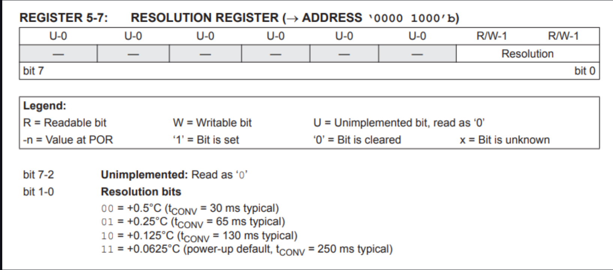
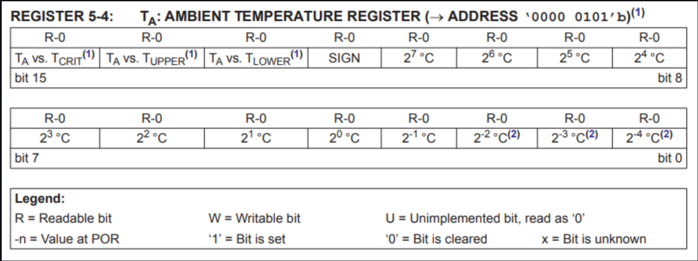

# Custom Device Drivers in Zephyr

<!-- TOC -->

- [Custom Device Drivers in Zephyr](#custom-device-drivers-in-zephyr)
	- [Driver Directory Structure](#driver-directory-structure)
	- [Device header](#device-header)
	- [Driver source code](#driver-source-code)
		- [Functions](#functions)
		- [Api assignment](#api-assignment)
			- [Devicetree expansion macro](#devicetree-expansion-macro)
		- [CMake Includes](#cmake-includes)
			- [modules/mcp9808/drivers/mcp9808/CMakeLists.txt](#modulesmcp9808driversmcp9808cmakeliststxt)
			- [modules/mcp9808/drivers/CMakeLists.txt](#modulesmcp9808driverscmakeliststxt)
			- [modules/mcp9808/CMakeLists.txt](#modulesmcp9808cmakeliststxt)
		- [Kconfig Settings](#kconfig-settings)
			- [modules/mcp9808/drivers/mcp9808/Kconfig](#modulesmcp9808driversmcp9808kconfig)
			- [modules/mcp9808/drivers/Kconfig](#modulesmcp9808driverskconfig)
			- [modules/mcp9808/Kconfig](#modulesmcp9808kconfig)
		- [Bindings File](#bindings-file)
			- [modules/mcp9808/dts/bindings/sensor/microchip,mcp9808.yaml](#modulesmcp9808dtsbindingssensormicrochipmcp9808yaml)
		- [Zephyr Module](#zephyr-module)
			- [modules/mcp9808/zephyr/module.yaml](#modulesmcp9808zephyrmoduleyaml)
			- [Example application CMake](#example-application-cmake)
			- [prj.conf](#prjconf)
			- [apps/read\_temp/prj.conf:](#appsread_tempprjconf)
		- [boards/esp32s3\_devkitc.overlay](#boardsesp32s3_devkitcoverlay)
			- [apps/read\_temp/boards/esp32s3\_devkitc.overlay](#appsread_tempboardsesp32s3_devkitcoverlay)
			- [Combined DTS file](#combined-dts-file)
		- [Application code](#application-code)
			- [apps/read\_temp/src/main.c](#appsread_tempsrcmainc)

<!-- /TOC -->

These are the reference to better understand how to write device drivers on Zephyr:
[DigiKey course material](https://www.digikey.com/en/maker/tutorials/2025/introduction-to-zephyr-part-6-device-driver-development)
[DigiKey example repository](https://github.com/ShawnHymel/workshop-zephyr-device-driver)

## Driver Directory Structure

Drivers in Zephyr require a very particular directory structure, as the C compiler, CMake, Kconfig, and the Devicetree Compiler (DTC) browse through folders recursively looking for their respective source files. By default, Zephyr wants you to develop drivers and board Devicetree source (DTS) files "in-tree," which means inside the Zephyr RTOS source code repository.

For large projects, this might make sense: you fork the main Zephyr repository and make the changes you need in the actual source code. You would then version control your fork of the Zephyr source code (e.g. with west).

An example directory structure for an "out-of-tree" driver is the following:

```ini
modules/
├── README.md
└── mcp9808/
    ├── CMakeLists.txt
    ├── Kconfig
    ├── drivers/
    │   ├── CMakeLists.txt
    │   ├── Kconfig
    │   └── mcp9808/
    │       ├── CMakeLists.txt
    │       ├── Kconfig
    │       ├── mcp9808.c
    │       └── mcp9808.h
    ├── dts/
    │   └── bindings/
    │       └── sensor/
    │           └── microchip,mcp9808.yaml
    └── zephyr/
        └── module.yaml
```

- We're keeping things separate: application code goes in apps/ and driver code goes in modules/.
- The CMakeLists.txt files tell the CMake build system where to find the code for our driver.
- The Kconfig files create an entry in the Kconfig system that allows us to enable, disable, and configure our software components (i.e. the driver code).
- The mcp9808.c and mcp9808.h files hold our actual device driver code.
- The microchip,mcp9808.yaml file is our Devicetree bindings file. It is the glue that helps connect Devicetree settings (in DTS syntax) to our code (in C). It uses the YAML syntax and can end in _.yaml or _.yml.
- The dts/bindings/sensor/ naming and structure matters. During the build process, Zephyr looks for bindings files (\*.yaml) recursively in dts/bindings/ folders in its modules.
- Speaking of modules, the zephyr/module.yml file formally declares this directory (modules/mcp9808/) as a Zephyr module so it knows where to find the source, Kconfig, and bindings files. Once again, the folder and file name are important here: Zephyr looks for this particular file in this particular directory. It also uses the YAML syntax and must be named module.yaml or module.yml.

Note: The device driver used in this example is based on the existing zephyr/drivers/sensor/jedec/jc42 driver, with the bindings file found in zephyr\dts\bindings\sensor\jedec,jc-42.4-temp.yaml. We drop interrupt/trigger support and pare it down to just the essentials to demonstrate how to create an out-of-tree driver module.

## Device header

```c
#ifndef ZEPHYR_DRIVERS_SENSOR_MICROCHIP_MCP9808_H_
#define ZEPHYR_DRIVERS_SENSOR_MICROCHIP_MCP9808_H_

#include <zephyr/drivers/sensor.h>

// MCP9808 registers
#define MCP9808_REG_CONFIG     0x01
#define MCP9808_REG_TEMP_AMB   0x05
#define MCP9808_REG_RESOLUTION 0x08

// Ambient temperature register information
#define MCP9808_TEMP_SCALE_CEL 16
#define MCP9808_TEMP_SIGN_BIT  BIT(12)
#define MCP9808_TEMP_ABS_MASK  0x0FFF

// Sensor data
struct mcp9808_data {
	uint16_t reg_val;
};

// Configuration data
struct mcp9808_config {
	struct i2c_dt_spec i2c;
	uint8_t resolution;
};

#endif /* ZEPHYR_DRIVERS_SENSOR_MICROCHIP_MCP9808_H_ */`

```

There is not much here! We define some constant values and a couple of structs. The weirdest thing is the lack of public-facing functions. In most C/C++ projects, we define our API in the header file that we then #include in our application (or other source files). In our driver, we are going to rely on the Devicetree to define our public-facing API. We'll see how to do that in the .c file. For now, know that almost all driver functions should be private (defined as static) in the source (.c) file(s).

We define our I2C device register addresses, as given by the MCP9808 datasheet. The MCP9808 has a number of extra functions that we will ignore for this workshop--namely the ability to set thresholds and toggle an interrupt trigger pin. We want to focus on the simple actions of setting the RESOLUTION register at boot time and then reading from the AMBIENT TEMPERATURE register at regular intervals.

The RESOLUTION register (address 0x08) uses just 2 bits to set the resolution. We'll create an enum in the Devicetree that allows users to set the resolution to one of the four available values. Our driver code will read the value from the Devicetree configuration and set the desired resolution in the register during boot initialization.



The AMBIENT TEMPERATURE register (address 0x05) stores temperature data in 12-bit format with an extra bit used for the sign. We'll ignore bits 13-15, as they're used for setting thresholds. This is a 16-bit register, so we'll read from the register and convert the 12-bit temperature value (plus sign bit) to a usable value in our code.



## Driver source code

```c
// Ties to the 'compatible = "microchip,mcp9808"' node in the Devicetree
#define DT_DRV_COMPAT microchip_mcp9808

#include <errno.h>
#include <zephyr/drivers/i2c.h>
#include <zephyr/sys/byteorder.h>
#include <zephyr/logging/log.h>

#include "mcp9808.h"

// Enable logging at a given level
LOG_MODULE_REGISTER(MCP9808, CONFIG_SENSOR_LOG_LEVEL);

//------------------------------------------------------------------------------
// Forward declarations

static int mcp9808_reg_read(const struct device *dev,
							uint8_t reg,
							uint16_t *val);
static int mcp9808_reg_write_8bit(const struct device *dev,
								  uint8_t reg,
								  uint8_t val);
static int mcp9808_init(const struct device *dev);
static int mcp9808_sample_fetch(const struct device *dev,
								enum sensor_channel chan);
static int mcp9808_channel_get(const struct device *dev,
							   enum sensor_channel chan,
							   struct sensor_value *val);

//------------------------------------------------------------------------------
// Private functions

// Read from a register (at address reg) on the device
static int mcp9808_reg_read(const struct device *dev,
							uint8_t reg,
							uint16_t *val)
{
	const struct mcp9808_config *cfg = dev->config;

	// Write the register address first then read from the I2C bus
	int ret = i2c_write_read_dt(&cfg->i2c, &reg, sizeof(reg), val, sizeof(*val));
	if (ret == 0) {
		*val = sys_be16_to_cpu(*val);
	}

	return ret;
}

// Write to a register (at address reg) on the device
static int mcp9808_reg_write_8bit(const struct device *dev,
								  uint8_t reg,
								  uint8_t val)
{
	const struct mcp9808_config *cfg = dev->config;

	// Construct 2-bute message (address, value)
	uint8_t buf[2] = {
		reg,
		val,
	};

	// Perform write operation
	return i2c_write_dt(&cfg->i2c, buf, sizeof(buf));
}

// Initialize the MCP9808 (performed by kernel at boot)
static int mcp9808_init(const struct device *dev)
{
	const struct mcp9808_config *cfg = dev->config;
	int ret = 0;

	// Print to console
	LOG_DBG("Initializing");

	// Check the bus is ready and there is a software handle to the device
	if (!device_is_ready(cfg->i2c.bus)) {
		LOG_ERR("Bus device is not ready");
		return -ENODEV;
	}

	// Set temperature resolution (make sure we can write to the device)
	ret = mcp9808_reg_write_8bit(dev, MCP9808_REG_RESOLUTION, cfg->resolution);
	LOG_DBG("Setting resolution to index %d", cfg->resolution);
	if (ret) {
		LOG_ERR("Could not set the resolution of mcp9808 module");
		return ret;
	}

	return ret;
}

//------------------------------------------------------------------------------
// Public functions (API)

// Read temperature value from the device and store it in the device data struct
// Call this before calling mcp9808_channel_get()
static int mcp9808_sample_fetch(const struct device *dev,
								enum sensor_channel chan)
{
	struct mcp9808_data *data = dev->data;

	// Check if the channel is supported
	if ((chan != SENSOR_CHAN_ALL) && (chan != SENSOR_CHAN_AMBIENT_TEMP)) {
		LOG_ERR("Unsupported channel: %d", chan);
		return -ENOTSUP;
	}

	// Perform the I2C read, store the data in the device data struct
	return mcp9808_reg_read(dev, MCP9808_REG_TEMP_AMB, &data->reg_val);
}

// Get the temperature value stored in the device data struct
// Make sure to call mcp9808_sample_fetch() to update the device data
static int mcp9808_channel_get(const struct device *dev,
							   enum sensor_channel chan,
			    			   struct sensor_value *val)
{
	const struct mcp9808_data *data = dev->data;

	// Convert the 12-bit two's complement to a signed integer value
	int temp = data->reg_val & MCP9808_TEMP_ABS_MASK;
	if (data->reg_val & MCP9808_TEMP_SIGN_BIT) {
		temp = -(1U + (temp ^ MCP9808_TEMP_ABS_MASK));
	}

	// Check if the channel is supported
	if (chan != SENSOR_CHAN_AMBIENT_TEMP) {
		LOG_ERR("Unsupported channel: %d", chan);
		return -ENOTSUP;
	}

	// Store the value as integer (val1) and millionths (val2)
	val->val1 = temp / MCP9808_TEMP_SCALE_CEL;
	temp -= val->val1 * MCP9808_TEMP_SCALE_CEL;
	val->val2 = (temp * 1000000) / MCP9808_TEMP_SCALE_CEL;

	return 0;
}

//------------------------------------------------------------------------------
// Devicetree handling - This is the magic that connects this driver source code
// 	to the Devicetree so that you can use it in your application!

// Define the public API functions for the driver
static const struct sensor_driver_api mcp9808_api_funcs = {
	.sample_fetch = mcp9808_sample_fetch,
	.channel_get = mcp9808_channel_get,
};

// Expansion macro to define the driver instances
// If inst is set to "42" by the Devicetree compiler, this macro creates code
// with the unique id of "42" for the structs, e.g. mcp9808_data_42.
#define MCP9808_DEFINE(inst)                                        		   \
																			   \
	/* Create an instance of the data struct */								   \
	static struct mcp9808_data mcp9808_data_##inst;                 		   \
                                                                    		   \
	/* Create an instance of the config struct and populate with DT values */  \
	static const struct mcp9808_config mcp9808_config_##inst = {			   \
		.i2c = I2C_DT_SPEC_INST_GET(inst),                          		   \
		.resolution = DT_INST_PROP(inst, resolution),               		   \
	};        																   \
                                                                    		   \
	/* Create a "device" instance from a Devicetree node identifier and */	   \
	/* registers the init function to run during boot. */					   \
	SENSOR_DEVICE_DT_INST_DEFINE(inst, 										   \
								 mcp9808_init, 								   \
								 NULL, 										   \
								 &mcp9808_data_##inst,						   \
				     			 &mcp9808_config_##inst, 					   \
								 POST_KERNEL,                       		   \
				     			 CONFIG_SENSOR_INIT_PRIORITY, 				   \
								 &mcp9808_api_funcs);						   \

// The Devicetree build process calls this to create an instance of structs for
// each device (MCP9808) defined in the Devicetree Source (DTS)
DT_INST_FOREACH_STATUS_OKAY(MCP9808_DEFINE)
```

We define the compatible name as microchip_mcp9808 using the `DT_DRV_COMPAT` macro, which is a special macro provided by Zephyr. Because I2C is a bus architecture, we could have multiple MCP9808 devices attached to the same bus (each with its own bus address). To handle this (without relying on object-oriented programming e.g. C++), **we must create instances of our driver config, data, and API functions that exist separately of each other when we compile our code**. Zephyr gives us a series of macros to help us create these instances.

You can create non-instance driver code, but we'll rely on Zephyr's instance-based driver macros to help us handle multiple I2C devices on the same bus. To use them, you must define `DT_DRV_COMPAT` before calling the instance expansion macros (found at the bottom of the code). During the build process, Zephyr looks for compatible symbols in the Devicetree source (DTS) files that match the compatible symbols in both the bindings files (which we'll explore later) and in the driver source code.

Note that compatible is almost always given as `vender,device` as a standard style in Devicetree lingo. As C macro symbols do not work with commas, the comma is converted to an underscore \_ when the build system is looking for matching source code files. In other words, if you use compatible = "microchip,mcp9808"; in your Devicetree source, you must use microchip_mcp9808 to define the matching driver source code macro.

### Functions

```c
static int mcp9808_reg_read(const struct device *dev,
							uint8_t reg,
							uint16_t *val);
```

Next, we declare our functions. Note the use gratuitous use of `static` here; we want to keep these functions private, which means that they can only be seen by the compiler inside this file. To illustrate how a Zephyr driver API works, I divided the functions into private and public sections, but notice that they are still all declared as static.

From there, we define our functions. The register reading and writing should be familiar if you've worked with I2C devices before. If not, I recommend reading[ this introduction to I2C](https://aticleworld.com/i2c-bus-protocol-and-interface/). In these functions, we call Zephyr's I2C API to handle the low-level functions for us.

_Note: Zephyr's I2C API offers a great layer of abstraction! We are not bound to using a specific chip or board **hardware abstraction layer** (HAL). Rather, Zephyr links to the necessary chip-specific HAL at build time when we specify the board (e.g. west build -b <board>). As a result, we can write truly device-agnostic driver code!_

To learn about the available I2C functions, you can either navigate to the I2C header file (zephyr/include/zephyr/drivers/i2c.h) or view the [API docs here](https://docs.zephyrproject.org/apidoc/latest/group__i2c__interface.html).

The interesting part is that we are creating instance-specific functions without the use of object-oriented programming. To do that, the I2C functions expect a `i2c_dt_spec` struct as their first parameter, which holds the bus (e.g. i2c0 or i2c1) and device address (e.g. 0x18 for the MCP9808). These are values that get populated from the Devicetree source, rather than from your application code. For example:

`int ret = i2c_write_read_dt(&cfg->i2c, &reg, sizeof(reg), val, sizeof(*val));`

Here, we perform the common pattern of writing a register address (reg) out to the device (at I2C address i2c->addr) and then reading the value from the register, which is saved to the val variable.

A common pattern in Zephyr is to save output values in parameters and use the return value to send a return code back to the caller. These codes are defined by POSIX.1-2017 and can be found in here in the Zephyr docs.

The init function will be registered to the kernel's boot process, and is (normally) called once prior to the application's `main()` being called.

The public functions adhere to the Zephyr Sensor API template, which can be found in `zephyr/include/zephyr/drivers/sensor.h`. We will assign these functions to a `sensor_driver_api` struct to enforce the use of this template. While we could define our own structs, the use of such templates provide common patterns for application developers. In other words, all Zephyr sensors will work in similar ways.

In particular, we will define the following public API functions:

- `sample_fetch` - The sensor takes a reading for the given channel (e.g. temperature, humidity, acceleration X, acceleration Y, etc.) and stores it in the device struct's data field.
- `channel_get` - Get the value of the desired channel that is currently stored in the device->data field.

### Api assignment

```c
// Define the public API functions for the driver
static const struct sensor_driver_api mcp9808_api_funcs = {
	.sample_fetch = mcp9808_sample_fetch,
	.channel_get = mcp9808_channel_get,
};
```

After we've declared (and/or defined) our public-facing functions, we assign them to the various fields in the `sensor_driver_api` struct. In a minute, we'll use this API struct to create a device instance that can be called from our application code.

#### Devicetree expansion macro

```c
#define MCP9808_DEFINE(inst)                                        		   \
																			   \
	/* Create an instance of the data struct */								   \
	static struct mcp9808_data mcp9808_data_##inst;                 		   \
                                                                    		   \
	/* Create an instance of the config struct and populate with DT values */  \
	static const struct mcp9808_config mcp9808_config_##inst = {			   \
		.i2c = I2C_DT_SPEC_INST_GET(inst),                          		   \
		.resolution = DT_INST_PROP(inst, resolution),               		   \
	};        																   \
                                                                    		   \
	/* Create a "device" instance from a Devicetree node identifier and */	   \
	/* registers the init function to run during boot. */					   \
	SENSOR_DEVICE_DT_INST_DEFINE(inst, 										   \
								 mcp9808_init, 								   \
								 NULL, 										   \
								 &mcp9808_data_##inst,						   \
				     			 &mcp9808_config_##inst, 					   \
								 POST_KERNEL,                       		   \
				     			 CONFIG_SENSOR_INIT_PRIORITY, 				   \
								 &mcp9808_api_funcs);
```

This is the magic that connects our code to the Devicetree. So long as the DT_DRV_COMPAT macro has been defined prior, the Zephyr build system generates instance-based C code. It relies heavily on [macro token concatenation](https://gcc.gnu.org/onlinedocs/cpp/Concatenation.html), also known as token pasting.

The Zephyr build system automatically assigns instance numbers to Devicetree nodes when there are multiple instances of that node under a parent node (e.g. multiple I2C devices under an I2C bus node). We will see this in action later.

During this build process, the preprocessor takes that instance number and generates C code, defining the data, functions, etc. for that instance. For example, if we define an MCP9808 device in the Devicetree, the build system will assign it an instance number (e.g. 42). The preprocessor will then generate the code from this macro as follows:

```c
/* Create an instance of the data struct */
static struct mcp9808_data mcp9808_data_42;

/* Create an instance of the config struct and populate with DT values */
static const struct mcp9808_config mcp9808_config_42 = {
    .i2c = I2C_DT_SPEC_INST_GET(42),
    .resolution = DT_INST_PROP(42, resolution),
};

/* Create a "device" instance from a Devicetree node identifier and */
/* registers the init function to run during boot. */
SENSOR_DEVICE_DT_INST_DEFINE(42,
                             mcp9808_init,
                             NULL,
                             &mcp9808_data_42,
                             &mcp9808_config_42,
                             POST_KERNEL,
                             CONFIG_SENSOR_INIT_PRIORITY,
                             &mcp9808_api_funcs);
```

This macro is fed into the FOREACH macro as an argument:

```c
DT_INST_FOREACH_STATUS_OKAY(MCP9808_DEFINE)
```

This `FOREACH` macro tells the preprocessor to generate structs/functions for each instance found in the Devicetree (as long as its `status` property is set to` "okay"`).

### CMake Includes

We need to tell the build system where to find the source files. As Zephyr relies on CMake, that involves creating a CMakeLists.txt file in each of the folders leading up to the actual .h and .c files.

Note: Zephyr defines a number of extra macros and functions that extend/customize CMake. You can find them in the zephyr/cmake/modules/extensions.cmake file.

#### modules/mcp9808/drivers/mcp9808/CMakeLists.txt

```cmakelists
# Declares the current directory as a Zephyr library
# If no name is given, the name is derived from the directory name
zephyr_library()

# List the source code files for the library
zephyr_library_sources(mcp9808.c)
```

#### modules/mcp9808/drivers/CMakeLists.txt

```cmakelists
# Custom Zephyr function that imports the mcp9808/ subdirectory if the Kconfig
# option MCP9808 is defined
add_subdirectory_ifdef(CONFIG_MCP9808 mcp9808)

```

#### modules/mcp9808/CMakeLists.txt

```cmakelists
# Include the required subdirectories
add_subdirectory(drivers)

# Add subdirectories to the compiler's include search path (.h files)
zephyr_include_directories(drivers)
```

### Kconfig Settings

We will define an "MCP9808" option in Kconfig that can be enabled to include the driver source code. This kind of module system helps keep the final application binary relatively small.

#### modules/mcp9808/drivers/mcp9808/Kconfig

```kconfig
# Create a new option in menuconfig
config MCP9808
	bool "MCP9808 Temperature Sensor"
	default n  		# Set the driver to be disabled by default
	depends on I2C  # Make it dependent on I2C
	help
	  Enable driver for the MCP9808 temperature sensor. This driver
	  depends on the I2C subsystem being enabled.
This creates a new option in our Kconfig system with the symbol MCP9808. The second line defines this as a boolean (with =y or =n as the only options). It also sets the default to n (disabled) and makes it depend on the I2C system being enabled.
```

#### modules/mcp9808/drivers/Kconfig

```
rsource "mcp9808/Kconfig"
Like with CMake, we need to tell Kconfig where to find the relevant Kconfig files. This one says to look in the relative source (rsource) of the mcp9808/ subdirectory for a file named Kconfig.
```

#### modules/mcp9808/Kconfig

```
rsource "drivers/Kconfig"
```

This says to look in the drivers/ subdirectory for a relevant Kconfig file.

Together, these files help the Zephyr build system find new (or modifications to) Kconfig options relevant to our driver.

### Bindings File

In order to connect the Devicetree settings to the driver source code so you can use it in your application, you need to create a bindings file. These files use the YAML syntax and create a specification for the various Devicetree properties that define the device.

#### modules/mcp9808/dts/bindings/sensor/microchip,mcp9808.yaml

```yaml
# Description of the device
description: Microchip MCP9808 temperature sensor

# Compatibility string that matches the one in the Devicetree source and
# DT_DRV_COMPAT macro in the driver source code
compatible: "microchip,mcp9808"

# Includes common definitions from other bindings files
#  - sensor-device.yaml - common sensor properties
#  - i2c-device.yaml - common I2C communication properties
include: [sensor-device.yaml, i2c-device.yaml]

# Defines specific Devicetree properties of the MCP9808 sensor
properties:
  resolution:
    type: int
    default: 3
    description: Sensor resolution. Default is 0.0625°C (3).
    enum:
      - 0 # 0.5°C
      - 1 # 0.25°C
      - 2 # 0.125°C
      - 3 # 0.0625°C
```

The bindings file must define a compatible field. The Zephyr build system looks for this string when parsing the Devicetree source files to know what bindings (i.e. interface) to use for a given node and its associated properties. Note that the filename of the bindings file does not matter; it is this field that matters!

We also include other bindings files here to enumerate common properties found in the sensor and i2c-device bindings.

In this example, we define a custom property (resolution) in addition to the ones given by the sensor-device and i2c-device bindings. It's best to think about these bindings files as defining an interface for nodes in the Devicetree: it specifies the required properties, their types, possible defaults, and (optionally) acceptable values.

Even though we specify these properties in YAML syntax, we will define Devicetree nodes in Devicetree source (DTS) syntax.

### Zephyr Module

We've created the required files that define the necessary device driver, at least according to what CMake, Kconfig, the Devicetree, and the compiler want. The final piece is telling Zephyr that it should treat all of these files and folders as a module. If we don't do this, Zephyr will fail to build and link to our driver code. Creating a Zephyr module is relatively straightforward: we just need a zephyr/module.yaml file in the top directory of our directory structure.

#### modules/mcp9808/zephyr/module.yaml

```yaml
name: mcp9808
build:
  cmake: .
  kconfig: Kconfig
  settings:
    dts_root: .
```

The first key-value pair specifies the name of the module: mcp9808. We then specify how the module should be built with the build section:

- `cmake` - tells the Zephyr build system where to look for CMake files (relative to the module's root directory)
- `kconfig` - path to the Kconfig file in the module's root directory
- `settings` - additional settings that Zephyr should know about
- `dts_root` - Zephyr will look for a dts/ directory at this location and search in there for additional Devicetree source (.dts) and bindings (.yaml, .yml) files

#### Example application CMake

```cmakelists
# Minimum CMake version
cmake_minimum_required(VERSION 3.20.0)

# Add additional modules
set(ZEPHYR_EXTRA_MODULES "${CMAKE_SOURCE_DIR}/./modules/mcp9808")

# Locate the Zephyr RTOS source
find_package(Zephyr REQUIRED HINTS $ENV{ZEPHYR_BASE})

# Name the project
project(read_temp)

# Locate the source code for the application
target_sources(app PRIVATE src/main.c)
```

We first define the minimum required version of CMake. We derive this from other CMakeLists.txt files found in the Zephyr RTOS source code.

Next, we tell Zephyr where to find our custom mcp9808 module by setting the ZEPHYR_EXTRA_MODULES variable to the module's path. Zephyr will look at this variable during the build process.

From there, we include the Zephyr RTOS source directory as a CMake package. If we configured Zephyr correctly, the ZEPHYR_BASE environment variable should be set in our OS. If not, we could use the path to the Zephyr directory instead.

Finally, we name the project and tell CMake where to find our source code files.

#### prj.conf

#### apps/read_temp/prj.conf:

```
CONFIG_GPIO=y
CONFIG_SENSOR=y
CONFIG_I2C=y
CONFIG_MCP9808=y
CONFIG_LOG=y
CONFIG_LOG_DEFAULT_LEVEL=4
```

.

In a terminal on your VS Code instance (inside the Docker container), navigate to the apps/read_temp/ directory and build the project with the -t menuconfig option:

### boards/esp32s3_devkitc.overlay

Even though we enabled the software portion of our module, we still need to set up the Devicetree node so that our driver code knows how to communicate with the physical device. That means defining an I2C address, assigning SDA and SCL pins, and associating the device with a particular I2C bus.

#### apps/read_temp/boards/esp32s3_devkitc.overlay

```dts
// Create an alias for our MCP9808 device
/ {
    aliases {
        my-mcp9808 = &mcp9808_18_i2c0;
    };
};

// Add custom pins to the node labeled "pinctrl"
&pinctrl {

	// Configure custom pin settings for I2C bus 0
    i2c0_custom_pins: i2c0_custom_pins {

		// Custom group name
        group1 {
            pinmux = <I2C0_SDA_GPIO9>, <I2C0_SCL_GPIO10>;	// SDA on GPIO9, SCL on GPIO10
            bias-pull-up; 									// Enable pull-up resistors for both pins
            drive-open-drain; 								// Required for I2C
            output-high; 									// Start with lines high (inactive state)
        };
    };
};

// Enable I2C0 and add MCP9808 sensor
&i2c0 {
    pinctrl-0 = <&i2c0_custom_pins>; 						// Use the custom pin configuration
    status = "okay"; 										// Enable I2C0 interface

	// Label: name of our device node
    mcp9808_18_i2c0: mcp9808@18 {
        compatible = "microchip,mcp9808"; 					// Specify device bindings/driver
        reg = <0x18>; 										// I2C address of the MCP9808
        status = "okay"; 									// Enable the MCP9808 sensor
        resolution = <3>; 									// Set the resolution
    };
};
```

Zephyr uses the Devicetree to configure hardware (and some software) components when building a project. An overlay file is a supplementary source file that is used to modify or extend the existing Devicetree source (DTS) files, which are pulled in from various SOC, board, and Zephyr locations (much like the Kconfig files). This is where we set pins and configure our custom MCP9808 module.

Note: Devicetree syntax can be overwhelming at first. I recommend taking a look at this guide to learn more.

Zephyr defines aliases and chosen nodes in the root node (/) that make addressing other subnodes easier. We create an alias to our device node label so that we can easily access that node in our application code. We define the mcp9808*18_i2c0 label later in the overlay file when we create our node. Note that alias names can only contain the characters [0-9a-z-], which means no underscores! C does not like dashes in names, so when we access this alias from code, we'll need to replace the dash - with an underscore *.

We then assign pins to a pin control group that we plan to use for our I2C bus. The & symbol says to access the node with the given label (e.g. pinctrl). This node is defined elsewhere for our board, and we just want to modify it.

We create a node (with the syntax label: node_name) to group our I2C pins. In there, we define a custom group to configure our pins. We use the pin control names defined in zephyr/include/zephyr/dt-bindings/pinctrl/esp32s3-pinctrl.h. This is how the ESP32 assigns functions to pins in Zephyr (e.g. using pins for I2C or UART rather than basic GPIO).

The &i2c0 is the label for our I2C bus 0 node on the Devicetree. The actual path is /soc/i2c@60013000, which denotes an I2C controller at memory address 0x60013000. This node is set by the SOC configuration. The label i2c0 is easier to use and makes our code more portable to other processors.

In this node, we overwrite the pinctrl-0 property with our new custom pin configuration and then enable the I2C0 controller by setting status = "okay"; (it is set to "disabled" by default). This is how we enable an I2C bus on the ESP32 with Zephyr: set the pins and set the status to "okay".

We then create a subnode with the name mcp9808@18. The @18 is a unit address--it is optional, but it can help readers understand how a device is addressed on a bus. In this node, we define several properties:

`- compatible` - This required string tells Zephyr where to look for the related bindings and driver files
`- reg` - Required address of the device on the bus (our MCP9808's default I2C bus address is 0x18)
`- status` - Required to enable ("okay") or disable ("disabled") the device
`- resolution` - The custom property we defined in our driver to set the temperature resolution. This value is ultimately passed to the instanced code of our driver, which is then sent to the RESOLUTION register in the init function at boot time.

Zephyr takes our overlay file and combines it with all of the other Devicetree source (.dts) and Devicetree source include (.dtsi) files it found for our SOC and board. It produces a combined DTS file at apps/read_temp/build/zephyr/zephyr.dts. If you open that file and search for "mcp9808," you should be able to find the custom node we created. Notice that it is a subnode of i2c0, as it is considered to be attached to that bus.

#### Combined DTS file

During the build process, Zephyr creates C macros for all of these device nodes and properties. You can find them defined in `apps/read_temp/build/zephyr/include/generated/zephyr/devicetree_generated.h`. Search for "mcp9808" and you'll find the 100+ macros that Zephyr created.

The macro naming scheme is based on navigating the Devicetree:

DT - Devicetree
N - node
S - slash
P - property
From this, we can figure out the generated macro for our resolution property, which is found at `/soc/i2c@60013000/mcp9808@18{resolution=3}`. This would become DT*N_S_soc_S_i2c_60013000_S_mcp9808_18_P_resolution (@ is not allowed in macro symbols, so it becomes an underscore *). Sure enough, if you search for that macro, you'll find it set to 3.

The other important macro is the \_ORD macro for our node. This is the instance number that Zephyr assigned to our node. Remember our macro magic in the driver code that expands based on each instance of the node? This is that instance number. For example, our data struct in the device driver would expand from mcp9808*data*##inst to mcp9808_data_90.

While this seems like a lot of configuration, it helps create portable device drivers and application code. By making just a few changes to your Devicetree file (and maybe Kconfig), you can port your code to another processor! This is why you'll often see board-specific overlay files in the boards/ folder of many projects. You can configure one application to build for several different boards.

### Application code

#### apps/read_temp/src/main.c

```c
#include <zephyr/kernel.h>
#include <zephyr/device.h>
#include <zephyr/drivers/sensor.h>
#include <stdio.h>

int main(void)
{
	const struct device *const mcp = DEVICE_DT_GET(DT_ALIAS(my_mcp9808));
	int ret;

    // Check if the MCP9808 is found
	if (mcp == NULL) {
		printf("MCP9808 not found.\n");
		return 0;
	}

    // Check if the MCP9808 has been initialized (init function called)
	if (!device_is_ready(mcp)) {
		printf("Device %s is not ready.\n", mcp->name);
		return 0;
	}

    // Loop
    while (1)
    {
        struct sensor_value tmp;

        // Fetch the temperature value from the sensor into the device's data structure
        ret = sensor_sample_fetch(mcp);
        if (ret != 0) {
            printf("Sample fetch error: %d\n", ret);
            return 0;
        }

        // Copy the temperature value from the device's data structure into the tmp struct
        ret = sensor_channel_get(mcp, SENSOR_CHAN_AMBIENT_TEMP, &tmp);
        if (ret != 0) {
            printf("Channel get error: %d\n", ret);
            return 0;
        }

        // Print the temperature value
        printf("Temperature: %d.%06d\n", tmp.val1, tmp.val2);

        // Sleep for 1 second
        k_sleep(K_SECONDS(1));
    }

    return 0;
}
```

The code has been commented to help you understand what is happening. But, I'll call out a few important sections as it relates to our driver.

We get a pointer to the instance of our mcp9808 driver by using the `DEVICE_DT_GET()` macro. We pass it the value of `DT_ALIAS(my_mcp9808)`, which expands to our Devicetree node given by the alias my-mcp9808. Remember that Devicetree aliases cannot contain underscores, and C does not like dashes in macro names. So, Zephyr automatically provides this conversion for us. Also note that we are passing in a macro symbol (my_mcp9808) rather than a string (or other C native data type). Zephyr's macro magic uses this symbol to find the associated Devicetree node.

This instance is returned as a device struct, which has certain properties defined by Zephyr. You can find this definition in `zephyr/include/zephyr/device.h`. Remember that our MCP9808 driver is a sensor, which is a type of device. Each of these classifications (sensor, device) provides certain definitions and interface requirements.

Whenever we want to use this device, we call the related functions (whether they are device functions, sensor functions, or mcp9808 functions) and pass in a pointer to our mcp device struct.

Side note: if this were C++, you'd call the member functions associated with that object. All this instancing macro magic is how Zephyr gets around object-oriented programming.

For our setup code, we first make sure that our MCP9808 instance was found by the `DEVICE_DT_GET()` macro by checking to see if the pointer is NULL. We then make sure that `mcp9808_init()` was automatically called during the boot process by checking if `device_is_ready()`.

If you recall from our device driver code, we only have two publically available functions: `sample_fetch` and `channel_get`. OK, we also have the functions, constants, and macros conferred to us by the Device API and Sensor API.

Side note: if you compared this to object-oriented programming, mcp9808 would be a subclass of sensor, which would be a subclass of device.

The sensor interface declares `sensor_sample_fetch()` and `sensor_channel_get()`. In our driver code, we assigned `mcp9808_sample_fetch()` and `mcp9808_channel_get()` to these functions respectively when we defined struct `sensor_driver_api` `mcp9808_api_funcs`. So, for example, when we call `sensor_sample_fetch()` in our application code, it actually calls `mcp9808_sample_fetch()` in our driver code.

The basic pattern for working with sensors is to first fetch the sample, which causes the sensor to take a reading before storing the result in an internal variable (dev->data). You then get the channel information, which returns the data stored in dev->data for the specified channel (only ambient tamperature in our case).
