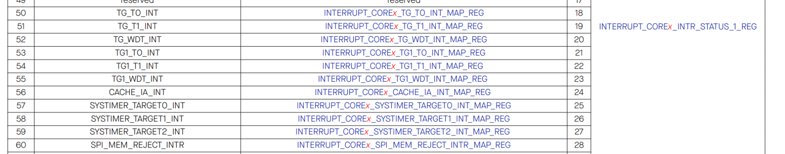
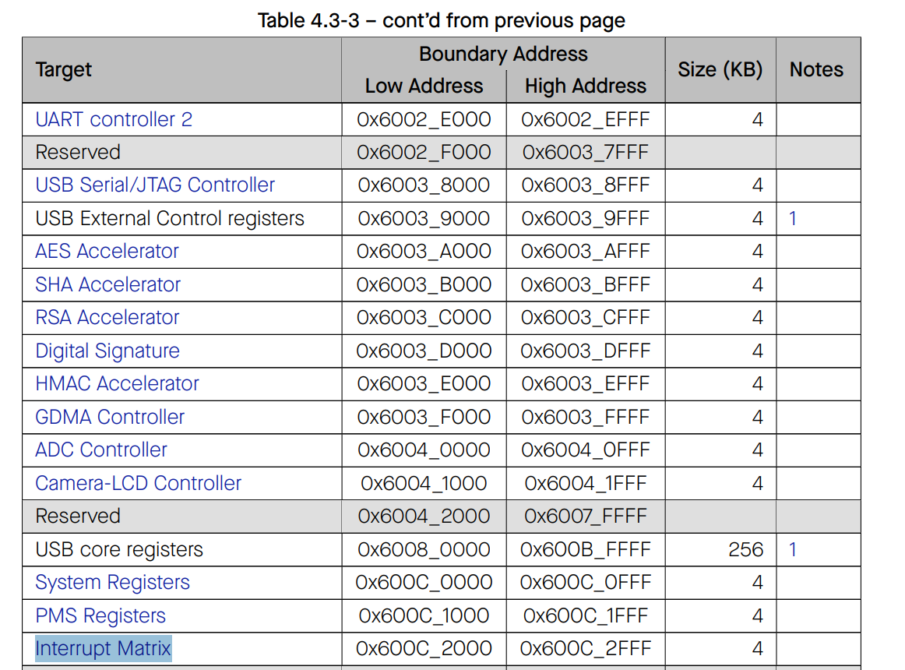
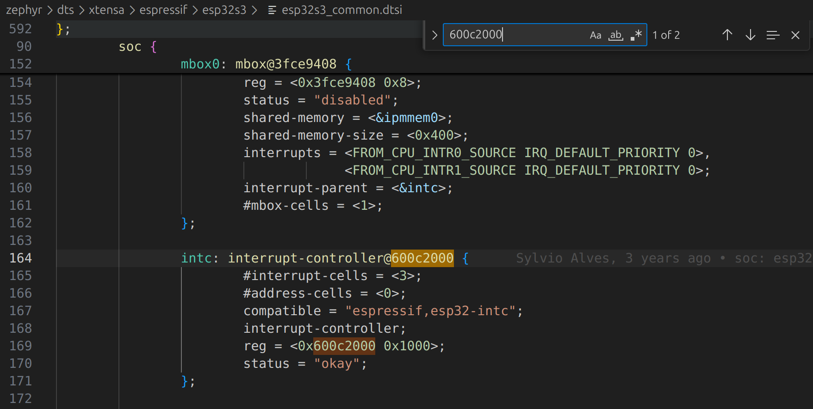
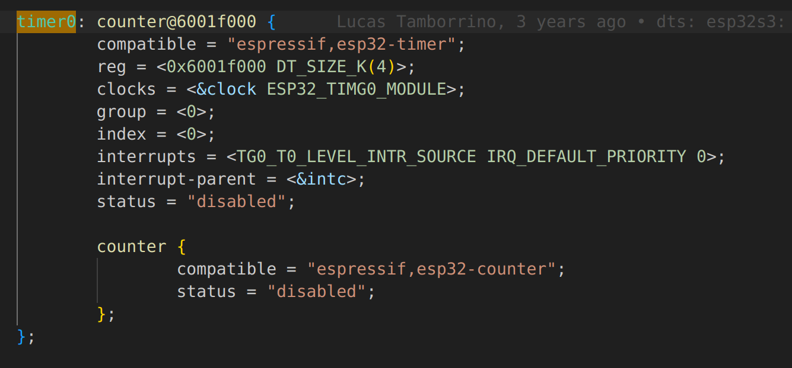
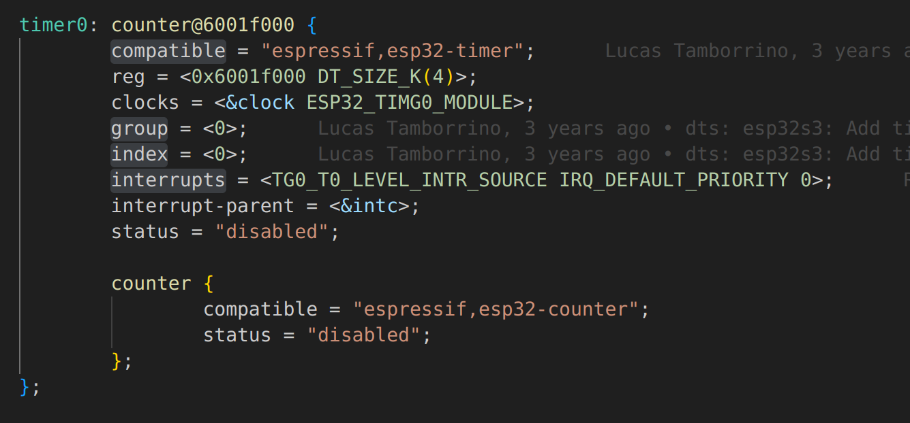
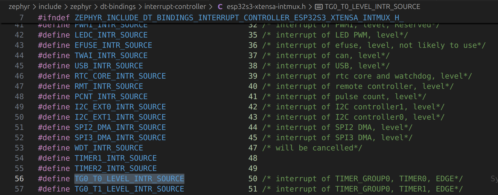
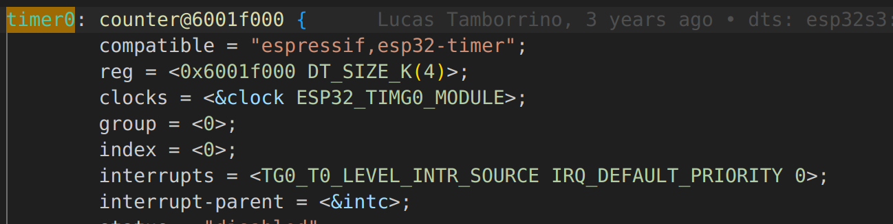
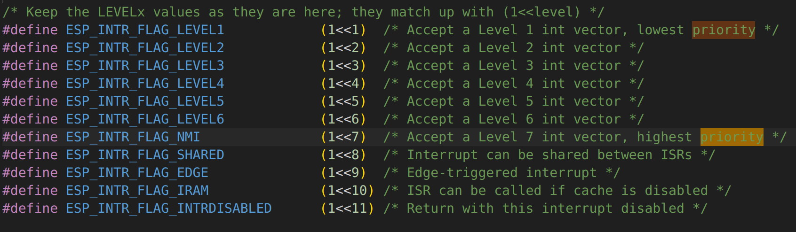

# Timers, counters, and interrupts

<!-- TOC -->

- [Timers, counters, and interrupts](#timers-counters-and-interrupts)
  - [Timers](#timers)
    - [Timer callback](#timer-callback)
    - [Starting a timer](#starting-a-timer)
      - [Tick vs Tickless RTOS](#tick-vs-tickless-rtos)
  - [Counters](#counters)
    - [ESP32 interrupts](#esp32-interrupts)
    - [Watchdog timers](#watchdog-timers)
    - [Interrupts priority levels](#interrupts-priority-levels)
    - [Interrupt controller](#interrupt-controller)
    - [Timer nodes](#timer-nodes)
    - [Default interrupt priority values](#default-interrupt-priority-values)
    - [Setting up a counter](#setting-up-a-counter)
    - [`esp32s3_devkitc.overlay`](#esp32s3_devkitcoverlay)
    - [`main.c`](#mainc)
  - [GPIO Interrupts](#gpio-interrupts)
    - [`main.c`](#mainc-1)
    - [Workqueue](#workqueue)

<!-- /TOC -->

Interrupts play a critical role in most microcontrollers as they can quickly and efficiently respond to events. These might be things like button pushes, new sensor readings, or even internal timers. Zephyr’s ability to abstract away hardware details means we can create cross-platform interrupt handlers.

Previously, we looked at running multiple threads and thread synchronization techniques. Now we’ll move into various features and applications, starting with a few interrupt-based demos. These include software timers, hardware counters, and pin change interrupts.

## Timers

Software-based timers rely on the Zephyr kernel’s system clock. These timers don’t require enabling any hardware interrupts or counters. However, it’s important to remember that since the system clock itself is driven by an internal timer configured by the hardware vendor, interrupts are still being used and they’re simply abstracted away by Zephyr.

On the ESP32-S3, the default timer resolution is 100 microseconds, which is the highest precision you can achieve by default. This value can be adjusted in Kconfig if needed. Although software timers are less precise than hardware counters , they provide an easy-to-use, high-level API that simplifies setup and use.

To demonstrate, we’ll create a simple timer demo. No overlay file is needed for this example, making it straightforward. We’ll create a new source file named main.c and include the standard input/output headers along with the Zephyr kernel header.

```c
#include <stdio.h>
#include <zephyr/kernel.h>

// Settings
#define TIMER_MS 1000

// Struct for holding timer information
static struct k_timer my_timer;
```

### Timer callback

```c
// Timer callback
void timer_callback(struct k_timer *timer)
{
    // Check to make sure the correct timer triggered
    if (timer == &my_timer) {
        printk("Timer!\r\n");
    }
}

```

The interface for this timer is defined by Zephyr, and according to the specification, our callback function must accept the timer structure we configured as a parameter. This allows us to access the timer instance, reset it, or perform any necessary actions within the callback.

It’s generally a good practice — especially when multiple timers might trigger the same callback — to verify which timer instance invoked it. This ensures that the correct timer is being handled. You can also use this approach to execute different actions depending on which timer has expired, even when all of them share the same callback function.

In our example, we’ll simply check that the timer triggering the callback is the one we configured. This demonstrates how multiple timers can coexist, each potentially performing different tasks based on conditional checks inside the callback.

### Starting a timer

Next, in the main function, we’ll initialize the timer using the `k_timer_init()` function. This function takes two arguments:

- The timer structure we defined.

- The callback function that should be invoked when the timer expires.

```c
int main(void)
{
    // Initialize the timer
    k_timer_init(&my_timer, timer_callback, NULL);

    // Wait 1 sec (duration) before calling the callback and then call the
    // callback every 1 sec after (period)
    k_timer_start(&my_timer, K_MSEC(TIMER_MS), K_MSEC(TIMER_MS));

    // Do nothing
    while (1) {
        k_sleep(K_FOREVER);
    }

    return 0;
}
```

If you look at the API reference for `k_timer_init()`, you’ll find that the callback function is automatically called every time the timer expires. There’s also an optional secondary callback for when the timer stops while running — we won’t use that in this example, so we’ll pass NULL for that parameter.

After initializing the timer, we start it using `k_timer_start()`. We pass in the initialized timer structure (in this case, my_timer) and define the duration before the callback is triggered. The second parameter specifies the timeout period, and we’ll use the `K_MSEC(TIMER_MS)` macro to represent 1,000 milliseconds (or one second).

The third parameter defines the period, which determines whether the callback runs once or periodically. If you set a non-zero period, Zephyr repeatedly calls the callback at that interval. In our demo, we’ll make the timer periodic, triggering every `TIMER_MS` milliseconds.

After setting up the timer, our main loop doesn’t need to perform any active work. We’ll use `k_sleep(K_FOREVER)` to suspend the main thread indefinitely, keeping the system idle while the timer runs in the background.

And as with any good Zephyr application, we’ll return 0 at the end of `main()`, even though program execution never actually reaches that point.

Next, we’ll navigate to the build folder, open the Zephyr directory, and examine the configuration file. Inside, search for the setting `SYS_CLOCK_TICKS_PER_SEC`. This parameter defines how many system ticks occur each second in the operating system. In tick-based RTOSes, each tick triggers an interrupt that causes the scheduler — typically running as a background process — to determine which thread should execute next. However, **Zephyr operates as a tickless operating system**, which works differently.

#### Tick vs Tickless RTOS

At first glance, a frequency of 10 kHz may seem high compared to traditional tick-based systems like FreeRTOS, which often run at around 100 Hz. But in a tickless kernel, the system doesn’t rely on regular, periodic ticks. Instead, Zephyr calculates when the next task or event needs to occur, programs a timer interrupt for that exact moment, and then enters a sleep state. For example, if the kernel determines that a high-priority thread must run in 150 milliseconds, it sets a timer to wake itself up precisely at that time instead of waking up every tick. While this approach is more complex, it offers significant power efficiency, since the scheduler doesn’t need to wake up constantly.

As you can see, the setup is straightforward and requires very little code. Software timers are simple, reliable, and convenient for most applications. Unless you require extremely high timing precision (better than 100 microseconds), these are ideal.

For cases that demand higher resolution, you can use hardware-based timers, which we’ll explore next.

## Counters

If you require higher timing resolution, you’ll need to move beyond software timers and use hardware-based timers, which involve additional configuration, particularly within the device tree. These timers depend directly on the hardware of the microcontroller, and because each platform implements them differently, a bit of hardware-specific knowledge is necessary.

In Zephyr terminology, hardware-based timers are referred to as counters, while timers refer specifically to software-based timers (like the ones demonstrated earlier). This naming convention can differ from what you see in microcontroller datasheets, where both hardware and software timing mechanisms are often called “timers.” To avoid confusion, remember this rule of thumb:

- **Timer** → **Software-based**, managed by the Zephyr kernel.

- **Counter** → **Hardware-based**, managed directly by the microcontroller.

Counters are more precise because they rely on hardware to generate timing events. However, this added precision comes at the cost of complexity — you must configure the device tree to link your application to the appropriate hardware peripheral, while keeping your code abstract enough to remain portable across platforms.

Zephyr provides a dedicated counter API to help with this. It allows you to set up counters that trigger interrupt service routines (ISRs) through callbacks, similar to how software timers work. The key difference is that these callbacks run in the ISR context, which means they execute immediately when the interrupt occurs.

The vendor — in this case, Espressif — supplies the low-level driver code that manages the hardware configuration. When you call Zephyr’s counter functions, they invoke this vendor-provided code under the hood. Still, you must define and enable the relevant hardware components within your device tree.

### ESP32 interrupts

To configure hardware counters properly, you’ll need a basic understanding of how interrupts are structured for your specific microcontroller.

The ESP32-S3 features 99 peripheral interrupt sources, which can be connected to physical hardware like GPIOs, UARTs, or internal timers. These interrupt sources feed into an interrupt matrix, which allows flexible mapping between hardware events and CPU interrupt lines.

In Zephyr terminology:

- These hardware connections are called interrupt lines.

- The software-assigned identifiers that refer to them are called interrupt numbers.

Each CPU core in the ESP32-S3 supports 32 interrupt slots, 26 of which are available for user configuration. The remaining six are reserved for critical system functions such as the watchdog timer, system ticks, and exception handling — you should not modify these.

In summary, the interrupt line represents the physical hardware connection, while the interrupt number is the logical software mapping. This separation allows Zephyr to flexibly assign and manage interrupts in a consistent, cross-platform way.

Some microcontrollers, such as the ESP32, allow mapping between interrupt lines and interrupt numbers. This provides flexibility in how hardware interrupt sources are assigned to software-handled interrupts. However, on simpler or older architectures — for example, certain 32-bit ARM Cortex-M0 chips — this mapping capability doesn’t exist. In those systems, interrupt lines are hardwired to specific interrupt numbers, meaning each hardware source is permanently tied to a fixed interrupt handler. If we refer to Section 9.3 of the [ESP32-S3 technical reference](https://www.espressif.com/sites/default/files/documentation/esp32-s3_technical_reference_manual_en.pdf), we can find the Interrupt Source Table, which lists all hardware interrupt sources and their corresponding identifiers. Each entry represents a hardware interrupt line, not a Zephyr “interrupt number.”

The ESP32-S3 provides 99 interrupt lines, numbered 0 through 98, each corresponding to a specific hardware source — such as GPIO, UART, or a timer. These connections are physically implemented within the microcontroller. The table also specifies which registers are used to configure or control each interrupt source. Fortunately, Zephyr’s vendor-provided driver code handles most of the low-level register setup automatically, so we generally don’t need to manipulate these registers directly. As application developers, our main concern is identifying the correct source, line number, and mapping it to an interrupt number when necessary.
For example, when working with timers, you’ll notice that Espressif labels them as TG, short for Timer Group.



- Timer Group 0 contains Timer 0 and Timer 1.

- Timer Group 1 also contains Timer 0 and Timer 1.

This gives us a total of four user-configurable timers. The Watchdog Timer (WDT) is separate — it’s managed automatically by the system and not something we’ll modify in this series.

Moving to Section 9.4, you’ll find the register map for these timers. Most of this configuration is handled by Zephyr, but it’s useful to understand how the hardware is organized. The register map shows offset addresses for each peripheral. If we refer back to Table 43, we can locate the base address for the interrupt matrix, which is 0x600C2000.



Keep this value in mind — it will appear later when examining Zephyr’s device tree files.

Finally, in Section 12, the documentation covers timer groups in more detail. Each timer group includes:

- One Watchdog Timer (WDT).

- Two user-configurable timers.

### Watchdog timers

Watchdog timers automatically reset the processor if they aren’t periodically “fed” — that is, updated within a certain time window. This mechanism protects the system from hangs or freezes. If you’ve worked with the ESP32 before, you’ve probably encountered a watchdog reset during debugging — for instance, if a thread stalls while waiting for a network operation, the WDT may trigger and restart the processor, resulting in a full system crash.

The ESP32’s timers also include a 16-bit prescaler, which divides the input clock (the APB clock) to produce slower count rates. Each counter is 54 bits wide, which allows an extremely large counting range. By comparison, many smaller microcontrollers use only 16-bit or 32-bit counters — an important consideration if you plan to write portable code that runs on multiple platforms.

### Interrupts priority levels

Now, let’s examine the interrupt priority levels for the ESP32. I referred to the ESP-IDF guide to find these because we’ll need to assign a priority level for a hardware interrupt, which is different from software thread priorities or software interrupts.

Unlike thread priorities, higher numbers indicate higher priority. Levels 1 through 3 are for general-purpose use, and this is typically where Espressif recommends creating user-level interrupts. You can use higher levels (4 and above), but Espressif requires writing assembly code for those, ensuring that the interrupt service routines are extremely fast and efficient.

There’s also a special non-maskable interrupt (NMI), reserved for critical events like the watchdog timer, power failures, or other critical faults. Usually, we don’t modify these unless we’re delving deep into microcontroller internals.

### Interrupt controller

With that context, let’s see how Zephyr handles this. We can close this terminal for now and dive into the Zephyr source code, which contains a lot of useful information. We’ll navigate to the Device Tree Source (DTS):

`dts/xtensa/espressif/esp32s3/esp32s3_common.dtsi`

This device tree include file provides a wealth of information about the ESP32-S3 configuration. It’s especially useful for checking timers, UARTs, or pin setups. Often, all you need is the label for a pin or peripheral and its status property so you can configure it correctly in your device tree overlay.

The reason I looked up the interrupt controller address is that it’s easy to find in this file. Searching for it brings us to the register properties, including the base address, size, and memory of the interrupt controller.



On the ESP32, it’s called `intc`. This controller follows a bindings file that connects it to Espressif’s driver code, and in our DTS, the status is already set to okay, meaning it’s enabled. By convention, Zephyr names the bindings file after the compatible string in YAML format.

`dts/bindings/interrupt-controller/espressif,esp32-intc.yaml`

This file contains a reg property that maps to the interrupt controller address, and its subnodes represent individual interrupts. Each subnode should include three properties.

```yaml
# Copyright (c) 2021 Espressif Systems (Shanghai) Co., Ltd.
# SPDX-License-Identifier: Apache-2.0

description: ESP32 Interrupt controller
compatible: "espressif,esp32-intc"

include: [interrupt-controller.yaml, base.yaml]

properties:
  reg:
    required: true

  "#interrupt-cells":
    const: 3

interrupt-cells:
  - irq
  - priority
  - flags
```

To declare an interrupt in Zephyr, you create an array with three cells corresponding to:

- `irq` – the interrupt request line number

- `priority` – in our case, 1 through 7, as per documentation

- `flags` – configuration options for the interrupt

### Timer nodes

Looking back at `esp32s3_common.dtsi`, we can search for timer0.



There are four timers, as noted earlier, spread across different groups. Each maps to a specific base address depending on its configuration registers and adheres to the ESP32 timer bindings file, which defines the interface. We can search that file for more details.

`dts/bindings/counter/espressif,esp32-timer.yaml`

```yaml
# Copyright (c) 2022 Espressif Systems (Shanghai) Co., Ltd.
# SPDX-License-Identifier: Apache-2.0

description: |
  ESP32 general-purpose timers.

  Each Timer is part of a Timer Group and the number of available Timers
  is SoC-dependent.

  As as example, ESP32 has 4 Timers available, which are split in two
  different groups (TIM0_G0, TIM1_G0, TIM0_G1 and TIM1_G1).

  In order to use one of the available timers on your application add
  a <board>.overlay file with contents as below

    &timer0 {
            status = "okay";
            prescaler = <10>;
    };

  From the above, setting 'status' is required while the prescaler is
  optional. Check below for more information on the prescaler.

include: base.yaml

properties:
  group:
    description: |
      The Timer Group index to which a timer belongs.
    type: int
    required: true
    enum:
      - 0
      - 1

  index:
    description: |
      The index that identifies a timer within a Timer Group.
    type: int
    required: true
    enum:
      - 0
      - 1

  prescaler:
    description: |
      The prescaler value defines the factor by which the APB clock will be
      divided. The outcome of which serves as clock reference to the Timer
      itself.

      The allowed values for this property are in the range [2..65535].
      Values above that range will be 16-bit-masked. Values 0 and 1 will be
      forced to 2.
    type: int
    default: 2

compatible: "espressif,esp32-timer"
```

This interface includes several properties that must be defined:

- `group` and `index` – for example, group 0 and timer 1 within that group.

- `prescaler` – a 16-bit value that divides the clock

These settings are specific to the ESP32. By configuring the device tree correctly, we can create portable code that should ideally run on different hardware architectures, as long as the overlay files are properly set up.

In `esp32s3_common.dtsi`, we see that:



- The group and index are defined (e.g., timer group 0, timer 1).

- The compatible property is set.

- The timer is connected to the interrupt controller through its memory location.

Inside `include/zephyr/dt-bindings/interrupt-controller/esp32s3-xtensa-intmux.h` we can see that all defined interrupts are listed, matching the datasheet documentation:

- Timer 0 → line 50

- Timer 1 → line 51 (both in timer group 0)



This aligns with the datasheet (section 9), which shows the hardware lines mapped to the interrupt numbers in code. This is how the hardware timer is linked to the interrupt.

Looking at the interrupt controller in `dts/bindings/interrupt-controller/espressif,esp32-intc.yaml`:

```yaml
# Copyright (c) 2021 Espressif Systems (Shanghai) Co., Ltd.
# SPDX-License-Identifier: Apache-2.0

description: ESP32 Interrupt controller
compatible: "espressif,esp32-intc"

include: [interrupt-controller.yaml, base.yaml]

properties:
  reg:
    required: true

  "#interrupt-cells":
    const: 3

interrupt-cells:
  - irq
  - priority
  - flags
```

We can see how to set up an interrupt node:



- `interrupts`:

  - `irq` → the interrupt line number (`TGO_T0_LEVEL_INTR_SOURCE`)

  - `priority` → set to default (`IRQ_DEFAULT_PRIORITY`)

  - `flags` → none in this case

- `interrupt-parent`: the interrupt controller node we examined earlier

Various interrupts attach to the controller via the interrupt parent, using the corresponding label in C. While the interrupt controller is enabled, timers are disabled by default.

The default priority in the device tree is 0, which is a bit unusual.
In the driver code, priority 0 allows the controller to assign levels 1–3 (low or medium). You can override this priority manually if a different level is required. Priorities are defined using bit flags, so it’s recommended to use the macros provided in the ESP32 documentation. For most cases, leaving the timer at default priority works fine.

### Default interrupt priority values

`include/zephyr/drivers/interrupt_controller/intc_esp32.h`



### Setting up a counter

The counter interface is slightly different from the timers we’ve used so far. Many timers allow you to set a top value, which tells the timer to count up to a certain level, call a callback, and then reset automatically. On the ESP32-S3, however, it doesn’t seem possible to set a custom top value in hardware or software. It’s unclear whether this is a hardware limitation or a quirk of the ESP32. This means we have to take a slightly different approach:

We can create an alarm callback that triggers whenever the counter reaches a certain value. The counter will continue beyond that value (up to its 54-bit maximum), but in the callback, we can reset the counter manually. This effectively replicates the behavior of a top value, just with a few extra lines of code.

### `esp32s3_devkitc.overlay`

```dts
/ {
    aliases {
        my-timer = &timer0;
    };
};

&timer0 {
    status = "okay";
    prescaler = <4000>;
};
```

- Enable the timer (status = "okay")

- Set the prescaler (arbitrary value – remember to divide the APB clock by this for the actual counter period)

### `main.c`

```
#include <stdio.h>
#include <zephyr/kernel.h>
#include <zephyr/drivers/counter.h>

// Settings
#define COUNTER_DELAY_US 1000000
#define ALARM_CH_ID 0

// Counter callback (ISR)
void counter_isr(const struct device *dev,
                uint8_t chan_id,
                uint32_t ticks,
                void *user_data)
{
    // We pass in the alarm_cfg as our user_data, so cast it back
    struct counter_alarm_cfg *alarm_cfg = user_data;

    // Reset alarm (no need to stop or reset the counter)
    alarm_cfg->ticks = counter_us_to_ticks(dev, COUNTER_DELAY_US);
    counter_set_channel_alarm(dev, ALARM_CH_ID, alarm_cfg);

    // Do something
    printk("Counter!\r\n");
}
```

Zephyr expects counter ISRs to have the following four parameters:

- `device` – the counter device that triggered the ISR

- `channel_id` – the alarm channel ID

- `ticks` – number of ticks counted

- `user_data` – any arbitrary user data

```c
int main(void)
{
    int ret;
    const struct device *counter_dev = DEVICE_DT_GET(DT_ALIAS(my_timer));

    // Make sure the counter device initialized correctly
    if (!device_is_ready(counter_dev)) {
        printk("Error: Timer device not ready\r\n");
        return 0;
    }

    // Configure the alarm
    struct counter_alarm_cfg alarm_cfg = {
        .callback = counter_isr,
        .ticks = counter_us_to_ticks(counter_dev, COUNTER_DELAY_US),
        .user_data = &alarm_cfg,  // Assign the alarm_cfg as user_data, so we can access it in the ISR
        .flags = 0
    };

    // Start the counter
    ret = counter_start(counter_dev);
    if (ret < 0) {
        printk("Error (%d): Failed to start counter\r\n", ret);
        return 0;
    }

    // Set alarm
    ret = counter_set_channel_alarm(counter_dev, ALARM_CH_ID, &alarm_cfg);
    if (ret < 0) {
        printk("Error (%d): Failed to configure timer\r\n", ret);
        return 0;
    }
    printk("Counter alarm set to %u ticks\r\n", alarm_cfg.ticks);

    // Do nothing
    while (1) {
        k_sleep(K_FOREVER);
    }

    return 0;
}
```

Let’s revisit the counter interface. If we examine it, we can see how the function is defined:

- It includes a channel ID, which means you can, in theory, set up multiple channels to trigger different alarms using the same hardware counter.

- The advantage is that a single counter can handle several alarms.

- In your ISR, you would need to check the channel ID to determine which alarm is firing, ensuring you handle the correct one.

For simplicity, we’re keeping it basic for now, but in practice you should verify that the channel ID matches the alarm you want to handle. For example, handle alarm channel ID 0 in this case.

Note that to be able to use hardware counters, we need to add this line in the `prj.conf`:

```ini
CONFIG_COUNTER=y
```

## GPIO Interrupts

Interrupts are very efficient and suitable for low-power or real-time applications. The last type of interrupt we want to cover is **pin change interrupts**, which are among the most commonly used. While there are other interrupt types, this example demonstrates how to set up your own interrupts and where to find the relevant information.

We’ll look at the GPIO driver documentation in Zephyr. Specifically, we want the function:

`gpio_pin_interrupt_configure()`

To simplify things, Zephyr provides a device tree variant with the \_dt suffix:

`gpio_pin_interrupt_configure_dt()`

This allows you to pass in a device tree spec, which abstracts away the manual setup and avoids having to manually configure registers. It’s essentially a wrapper for the standard function, pulling information directly from the device tree.

Set the interrupt type using flags, the flags are defined in the GPIO header file (gpio_flags_t), they are usually represented as bit flags in a uint32_t. You can find flags for:

- Disabling the interrupt

- Rising edge

- Falling edge

- Any toggle (high → low or low → high)

For buttons or other inputs, the relevant flag is `GPIO_INT_EDGE_TO_ACTIVE`. This differs from a simple rising or falling edge because it triggers based on the active state of the input, not the raw pin level. This allows you to handle both active-low and active-high buttons consistently, enabling more portable and abstracted code.

To configure a button to trigger a GPIO interrupt, let's take a look at the standard `.overlay` file to use it as an input:

```
/ {
    aliases {
        my-button = &button_1;
    };

    buttons {
        compatible = "gpio-keys";
        debounce-interval-ms = <50>;
        polling-mode;

        button_1: d5 {
            gpios = <&gpio0 5 (GPIO_ACTIVE_LOW | GPIO_PULL_UP)>;
        };
    };
};
```

We need to get rid ot `polling-mode`, because when it is activated the driver regularly checks the button state at a fixed interval. The CPU continuously reads the GPIO pin to detect state changes, this is active waiting and it does not rely on hardware events. If you want to use GPIO interrupts, the hardware itself will trigger the CPU when the pin changes state.
This allows your program to respond immediately without continuously checking the pin.

- `polling-mode` tells the driver to ignore interrupts and read the pin periodically.

- If both polling and interrupts are enabled, the driver may not configure the GPIO interrupt, so your ISR would never be called.

- Removing polling-mode lets the driver enable edge detection interrupts (rising, falling, or edge-to-active), which is required for your ISR to work.

### `main.c`

```c
#include <stdio.h>
#include <zephyr/kernel.h>
#include <zephyr/drivers/gpio.h>

// Settings
static const struct gpio_dt_spec btn = GPIO_DT_SPEC_GET(DT_ALIAS(my_button), gpios);

// Struct for holding GPIO-related callback functions
static struct gpio_callback btn_cb_data;

// GPIO callback (ISR)
void button_isr(const struct device *dev,
                struct gpio_callback *cb,
                uint32_t pins)
{
    // Check if the correct button was pressed
    if (BIT(btn.pin) & pins)
    {
        printk("Button pressed! Pin: %d\r\n", btn.pin);
    }
}
```

When setting up a GPIO interrupt in Zephyr, the callback function is central, you can find the callback function and its signature in the [GPIO driver documentation](https://docs.zephyrproject.org/apidoc/latest/structgpio__callback.html). The signature requires:

- The device that triggered the interrupt.
- A pointer to the callback struct.
- The pins bitmask indicating which pins caused the interrupt. This allows you to determine which pin triggered the ISR.

To figure out which pin caused the interrupt, take the pins variable passed into the callback and compare it with the pin field from your button struct. For example, you can use a bitwise AND with a BIT macro that left-shifts 1 by the pin number. If that bit is set, you know it was the pin that triggered the ISR. This approach **allows handling multiple pins in a single ISR**, and you can wrap each pin in its own button struct if needed.

While demonstrating, you might print which pin was pressed inside the ISR, but printing in ISR context is not recommended. A better approach is to set a flag and let the main thread handle further processing.

Before configuring the interrupt, ensure the button is properly initialized and set as an input. Remove any polling mode, since the interrupt will now handle events.

```c
int main(void)
{
    int ret;

    // Make sure that the button was initialized
    if (!gpio_is_ready_dt(&btn))
    {
        printk("ERROR: button not ready\r\n");
        return 0;
    }

    // Set the button as input (apply extra flags if needed)
    ret = gpio_pin_configure_dt(&btn, GPIO_INPUT);
    if (ret < 0)
    {
        printk("ERROR: could not set button as input\r\n");
        return 0;
    }

    // Configure the interrupt
    ret = gpio_pin_interrupt_configure_dt(&btn, GPIO_INT_EDGE_TO_ACTIVE);
    if (ret < 0)
    {
        printk("ERROR: could not configure button as interrupt source\r\n");
        return 0;
    }

    // Connect callback function (ISR) to interrupt source
    gpio_init_callback(&btn_cb_data, button_isr, BIT(btn.pin));
    gpio_add_callback(btn.port, &btn_cb_data);

    // Do nothing
    while (1)
    {
        k_sleep(K_FOREVER);
    }

    return 0;
}
```

The Zephyr API function `gpio_pin_interrupt_configure_dt()` is used to configure the interrupt. Pass in the device tree button spec and the `GPIO_INT_EDGE_TO_ACTIVE` flag. Using edge-to-active instead of rising or falling edge ensures the code works for both active-low and active-high buttons, making it more portable.

To connect the ISR to the interrupt source, first initialize a callback struct using `gpio_init_callback()`, passing in the ISR function pointer and the bitmask for the pin(s) you want to monitor. Then, register this callback with `gpio_add_callback()`, providing the GPIO port. This lets the GPIO subsystem know which ISR to call when an interrupt occurs. Each GPIO controller, like `gpio0` or `gpio1` on the ESP32, may have separate interrupt lines. If handling pins from multiple ports, you may need separate callbacks for each controller. The callback struct includes both the function pointer and the pin mask, and the GPIO subsystem monitors the port as a whole.

### Workqueue

In Zephyr, there is a concept called a work queue (work Q). This is essentially a default thread that is created for us, which sits in a waiting state for work items to appear in the queue. You can add functions (or function pointers) to this queue, and the work queue thread executes these functions in order.

The configuration options for a work queue include stack size, priority, and no-yield options. By default, the priority is set to 1, but the thread itself runs at -1, which is the lowest-priority cooperative thread.

To read more about Workqueue refert to the [Zephyr documentation](https://github.com/zephyrproject-rtos/zephyr/blob/main/doc/kernel/services/threads/workqueue.rst).
